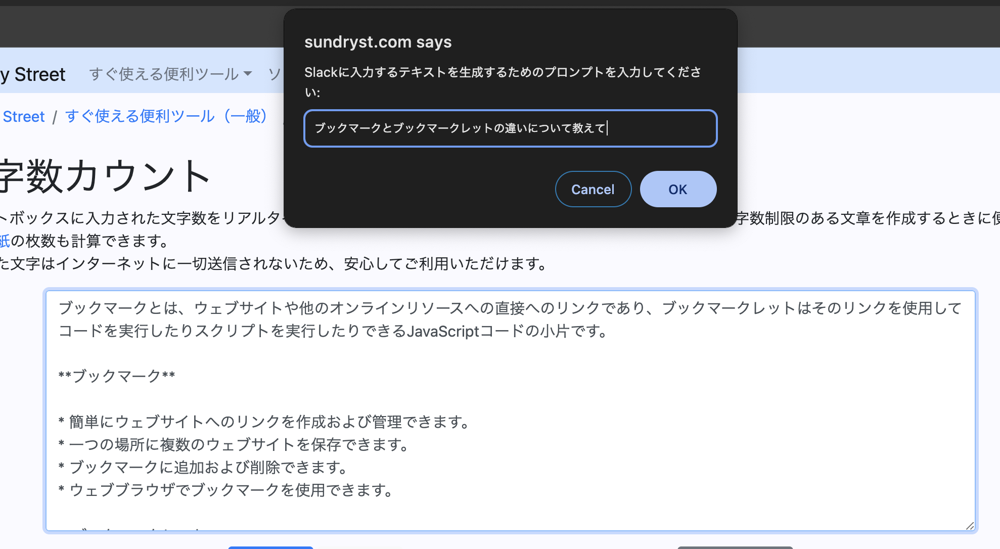

# ①課題番号-プロダクト名

gemini-nano搭載文章生成補助ツール

## ②課題内容（どんな作品か）

- gemini nanoのAPI（Prompt API）を使って、LLMの出力をブラウザの任意の場所に出力可能なブックマークレット
- ローカルで動くLLMを使っているので、実行回数によらず開発者は無料で利用可能

## ③DEMO
- なし（ブックマークレットのため任意のサイトで動作）
  - 現時点ではベータ版の機能を使っているため利用方法については⑦参照
  - 動画はChrome Version 130.0.6669.2 (Official Build) dev (arm64)で動作
-  

## ④作ったアプリケーション用のIDまたはPasswordがある場合
なし
<!-- - ID：dev@challenge-project.com
- PW：zK2n*N_m -->

## ⑤工夫した点・こだわった点
- ブラウザで文章入力する場所ならどこでも利用可能にしたこと
- 文調を指定できるようにしたこと

## ⑥難しかった点・次回トライしたいこと(又は機能)
- 難しかった点
    - β版の機能を使ったこと
      - 1ヶ月前の日本語の記事からすでに状況が変わっていて、英語のできるだけ一次情報に近いものを探して実装しました。
- 次回トライしたいこと
  - もう少しプロンプトを調整して実用可能なレベルにしたい
    - 例：slackの返信文に特化させるUI・UX
  - javascript経由で実際のLLMも呼び出せるようにしたい（お金かかるが高性能）

## ⑦質問・疑問・感想、シェアしたいこと等なんでも
- [感想]
  - ブラウザの機能にLLMが組み込まれたので、今回のブックマークレットのようなとても単純なコードで実社会で使える複雑な処理を行えるようになったのが感慨深い
  -  今までpixelに搭載されているgemini nanoって実際何ができるのかよくわからなかったが、実際使ってみることでその謎が解けた
     -  Googleがgemini nanoの機能を使ったユースケースを作ってスマホ等に搭載するのかと思っていたが、開発者向けの機能で一般に公開されているということがそもそもわかった
- [参考記事]
  - AI on Chromeドキュメント
    - https://developer.chrome.com/docs/ai/built-in?hl=ja#get_an_early_preview
  - PromptAPI利用方法
    - https://github.com/explainers-by-googlers/prompt-api/tree/main
  - 【AI】Chromeに組み込まれたGemini Nanoを使ってみる（ちょっと古いがchromeの設定方法の参考に）
    - https://qiita.com/pitao/items/f1355b8002e360f83c93